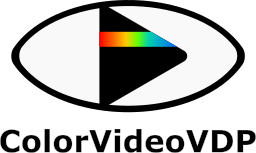
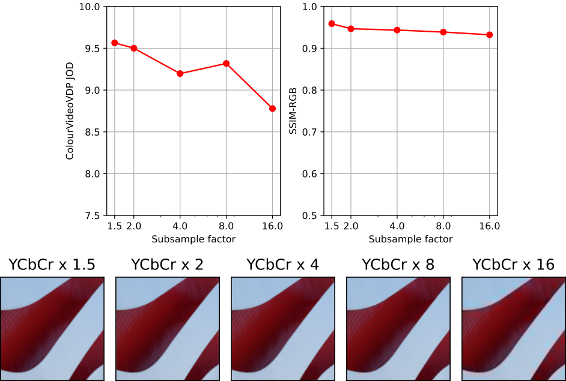

# ColorVideoVDP: A visible difference predictor for colour images and videos

[Web page](https://www.cl.cam.ac.uk/research/rainbow/projects/colorvideovdp/) | [Paper](https://www.cl.cam.ac.uk/~rkm38/pdfs/mantiuk2024_ColorVideoVDP.pdf)

 

ColorVideoVDP is a full-reference visual quality metric that predicts the perceptual difference between pairs of images or videos. Similar to popular metrics like PSNR, SSIM, and DeltaE 2000 it is aimed at comparing a ground truth reference against a distorted (e.g. blurry, noisy, color-shifted) version. 

This metric is unique because it is the first color-aware metric that accounts for spatial and temporal aspects of vision. 

The main features:
* models chromatic and achromatic contrast sensitivity using a novel contrast sensitivity model ([castleCSF](http://dx.doi.org/10.1167/jov.24.4.5)), allowing us to predict distortions in color and luminance;
* models spatio-temporal sensitivity so that it can predict visibility of artifacts like waveguide nonuniformity and other temporally varying artifacts;
* works with colorimetrically calibrated content, both SDR and HDR (any colour space);
* can predict a single number quality correlate, a distortion map or a visualization of an error over time and visual channels (distogram). 

ColorVideoVDP is implemented in PyTorch and can be run efficiently on a CUDA-enabled GPU. It can also run on a CPU, but the processing times will be much longer, especially for video. Its usage is described [below](#example-usage).

The metric is explained in details in:

> ColorVideoVDP: A visual difference predictor for image, video and display distortions.\
> Rafal K. Mantiuk, Param Hanji, Maliha Ashraf, Yuta Asano, Alexandre Chapiro.\
> In SIGGRAPH 2024 Technical Papers, Article 129\
> https://doi.org/10.1145/3658144

If you use the metric in your research, please cite the paper above. 

## PyTorch quickstart
1. Start by installing [anaconda](https://docs.anaconda.com/anaconda/install/index.html) or [miniconda](https://docs.conda.io/en/latest/miniconda.html). Then, create a new environment for ColorVideoVDP and activate it:
```bash
conda create -n cvvdp python=3.10
conda activate cvvdp
```

2. Install PyTorch by following [these instructions](https://pytorch.org/get-started/locally/) (OS-specific). **If you have an Nvidia GPU with appropriate drivers, it is recommended to install with conda for proper CUDA support**. To use MPS on a Mac, please install torch>=2.1.0.

2.a. [optional] If you plan on running on GPU (CUDA) install `pynvml`. 
```bash
pip install pynvml
```

3. Install [ffmpeg](https://ffmpeg.org/) and [FreeImage](https://freeimage.sourceforge.io/). The easiest option is to install using conda,
```bash
conda install ffmpeg conda-forge::freeimage
```

4. Obtain the ColourVDP codebase, by cloning the repository:
```bash
git clone git@github.com:gfxdisp/ColorVideoVDP.git   # skip if a .zip is provided or you use Github GUI
```

5. Finally, install ColorVideoVDP with PyPI:
```bash
cd ColorVideoVDP
pip install -e .
```
*Note:* The "-e/--editable" option to `pip` is optional and should be used only if you intend to change the ColorVideoVDP code.

After installation, run `cvvdp` directly from the command line:

```bash
cvvdp --test test_file --ref ref_file --display standard_fhd
```
The test and reference files can be images or videos. The option `--display` specifies a display on which the content is viewed. See [vvdp_data/display_models.json](pycvvdp/vvdp_data/display_models.json) for the available displays.

See [Command line interface](#command-line-interface) for further details. ColorVideoVDP can be also run directly from Python - see [Low-level Python interface](#low-level-python-interface). 

## Examples

Compare all `feris-test-*.mp4` files with the same reference `feris-ref.mp4` using a custom display model, store results in a CSV file `res.csv`:
```bash
cvvdp --test example_media/structure/ferris-test-*.mp4 --ref example_media/structure/ferris-ref.mp4 --config-paths=display_models_custom.json --display my_display --result res.csv
```
where the custom display is described in a JSON file `display_models_custom.json`:
```json
{
  "my_display": {
    "name": "30-inch 4K monitor, peak luminance 200 cd/m^2, viewed under office light levels (250 lux), seen from 2 x display height", 
    "resolution": [1920, 1080], 
    "viewing_distance_meters":  1.0,  
    "diagonal_size_inches": 22,   
    "max_luminance": 500,   
    "contrast": 3000,
    "E_ambient": 100,
    "k_refl": 0.01,
    "source": "none" } 
}
```
Note that the file name must be `display_models_*.json`. The format of this file is explained [here](pycvvdp/vvdp_data/README.md).

Compare two 30 fps video files stored as PNG frames:
```bash
cvvdp --test test_frame_%05d.png --ref reference_frame_%05d.png --display standard_4k --fps 30
```

The same as above, but use only frames 10, 12, 14, ... Use Matlab's range notation to select frames.
```bash
cvvdp --test test_frame_%05d.png --ref reference_frame_%05d.png --display standard_4k --fps 30 --frames 10:2:
```

Compare two HDR video files. Note that a display model with the right EOTF must be used.
```bash
cvvdp --test test_hdr_video.mp4 --ref reference_hdr_video.mp4 --display standard_hdr_pq
```

Check [examples](examples/) showing how to call ColorVideoVDP from Python or [matlab](matlab/) showing how to run a Matlab wrapper.

**Table of contents**
- [Display specification](#display-specification)
    - [Custom specification](#custom-display-specification)
- [HDR content](#hdr-content)
- [Reporting metric results](#reporting-metric-results)
- [Predicting quality scores](#predicted-quality-scores)
- [Usage](#example-usage)
    - [Command line interface](#command-line-interface)
    - [Visualization](#visualization)
    - [Configuration files](#configuration-files)
    - [Other metrics](#other-metrics)
    - [Display model preview](#display-model-preview)
    - [Interactive mode](#Interactive-mode)
    - [Python interface](#python-interface)
    - [Loss function](#loss-function)
    - [Matlab interface](#matlab-interface)
- [How to report issues?](#how-to-report-issues)
- [Release notes](#release-notes)

## Display specification

Unlike most image quality metrics, ColorVideoVDP needs physical specification of the display (e.g. its size, resolution, peak brightness) and viewing conditions (viewing distance, ambient light) to compute accurate predictions. The specifications of the displays are stored in [vvdp_data/display_models.json](pycvvdp/vvdp_data/display_models.json). You can add the exact specification of your display to this file, or create a new JSON file and pass the directory it is located in as `--config-paths` parameter (see [Configuration files](#configuration-files)). If the display specification is unknown to you, you are encouraged to use one of the standard display specifications listed on the top of that file, for example `standard_4k`, or `standard_fhd`. If you use one of the standard displays, there is a better chance that your results will be comparable with other studies. 

You specify the display by passing `--display` argument to `cvvdp`. Run with `--display ?` to get a list of available display models. 

Note the the specification in `display_models.json` is for the display and not the image. If you select to use `standard_4k` with the resolution of 3840x2160 for your display and pass a 1920x1080 image, the metric will assume that the image occupies one quarter of that display (the central portion). If you want to enlarge the image to the full resolution of the display, pass `--full-screen-resize {fast_bilinear,bilinear,bicubic,lanczos}` option (for now it works with video only). 

The command line version of ColorVideoVDP can take as input HDR video streams encoded using the PQ transfer function. To correctly model HDR content, it is necessary to pass a display model with correct color space and transfer function (with the field `colorspace="BT.2020-PQ"`), for example `standard_hdr_pq`.

### Custom display specification

If you run the metric from the command line, we recommend that you create a directory with a copy of `display_models.json`, add a new display specification in that file and then add to the command line `--config-paths <path-to-dir-with-json-file> --display <name-of-display-spec>`. The format of `display_models.json` is explained [here](tree/main/pycvvdp/vvdp_data#readme).

If you run the metric from Python code, the display photometry and geometry can be specified by passing `display_name` parameter to the metric. Alternatively, if you need more flexibility in specifying display geometry (size, viewing distance) and its colorimetry, you can instead pass objects of the classes `vvdp_display_geometry`, `vvdp_display_photo_gog` for most SDR displays, and `vvdp_display_photo_absolute` for HDR displays. You can also create your own subclasses of those classes for custom display specification. 

## HDR content

(Python command line only) You can use the metric to compare: 

* HDR video files encoded using PQ EOTF function (SMPTE ST 2084). Pass the video files as `--test` and `--ref` arguments and specify `--display standard_hdr_pq`.

* OpenEXR images. The images *MUST* contain absolute linear colour values (colour graded values, emitted from the display). That is, if the disply peak luminance is 1000, RGB=(1000,1000,1000) corresponds to the maximum value emitted from the display. If you pass images with the maximum value of 1, the metric will assume that the images are very dark (the peak of 1 nit) and result in incorerect predictrions. You need to specify `--display standard_hdr_linear` to use correct EOTF. Note that the default installation skips the [PyEXR](https://pypi.org/project/PyEXR/) package, which is required to read `.exr` files. To install, run:
```bash
conda install -c conda-forge openexr-python   # or "sudo apt install openxr" on Linux machines
pip install pyexr
```
**Troubleshooting on Linux:** You may need to update your library path by adding the following line to your `~/.bashrc`:
```bash
export LD_LIBRARY_PATH=$LD_LIBRARY_PATH:/path/to/conda/miniconda3/lib
```

## Reporting metric results

When reporting the results of the metric, please include the string returned by the metric, such as:
`"ColorVideoVDP v0.4.1, 75.4 [pix/deg], Lpeak=200, Lblack=0.5979 [cd/m^2], (standard_4k)"`
This is to ensure that you provide enough details to reproduce your results. 

## Predicted quality scores

ColorVideoVDP reports image/video quality in the JOD (Just-Objectionable-Difference) units. The highest quality (no difference) is reported as 10 and lower values are reported for distorted content. In case of very strong distortion, or when comparing two unrelated images, the quality value can drop below 0. 

The main advantage of JODs is that they (a) should be linearly related to the perceived magnitude of the distortion and (b) the difference of JODs can be interpreted as the preference prediction across the population. For example, if method A produces a video with the quality score of 8 JOD and method B gives the quality score of 9 JOD, it means that 75% of the population will choose method B over A. The plots below show the mapping from the difference between two conditions in JOD units to the probability of selecting the condition with the higher JOD score (black numbers on the left) and the percentage increase in preference (blue numbers on the right).

<table>
  <tr>
    <td>Fine JOD scale</td>
    <td>Coarse JOD scale</td>
  </tr>
  <tr>
    <td></img></td>
    <td></img></td>
  </tr>
</table>

# Example usage

## Command line interface
The main script to run the model on a set of images or videos is [run_cvvdp.py](pycvvdp/run_cvvdp.py), from which the binary `cvvdp` is created. Run `cvvdp --help` for detailed usage information.

For the first example, we will compare the performance of ColorVideoVDP to the popular Delta E 2000 color metric. A video was degraded with 3 different color artifacts using ffmpeg:
1. Gaussian noise: `ffmpeg ... -vf noise=alls=28.55:allf=t+u ...`
1. Increased saturation: `ffmpeg ... -vf eq=saturation=2.418 ...`
1. Colorbalance: `ffmpeg ... -vf colorbalance=rm=0.3:gm=0.3:bm=0.3:rs=0.15:gs=0.2:bs=0.2`

The magnitude of each degradation was adjusted so that the predicted maximum **Delta E 2000 = 33.5**. As Delta E 2000 is not sensitive to spatial or temporal components of the content, it is unable to distinguish between these cases.

To predict quality with ColorVideoVDP (shown below), run:

```bash
cvvdp --test example_media/structure/ferris-test-*.mp4 --ref example_media/structure/ferris-ref.mp4 --display standard_fhd --heatmap supra-threshold --distogram
```

|Original |  | Quality | Heatmaps |
| :---: | :---: | :---: | :---: |
| Gaussian noise |  | DE00 = 33.5  <br /> CVVDP = 8.87 |  |
| Saturation |  | DE00 = 33.5 <br /> CVVDP = 6.55 |  |
| Colorbalance |  | DE00 = 33.5 <br /> CVVDP = 5.59 |  |

## Visualization

In addition to the single-valued quality scored in the JOD units, ColorVideoVDP can generate a heatmap (video or image) and a distogram. The heatmap is generated when `--heatmap` command argument is passed with one of the following options:
* `supra-threshold` - the difference values between 0 and 3 will be mapped to blue to yellow colors (visualizes large differences)
* `threshold` - the difference values between 0 and 1 will be mapped to green to red colors (visualizes small differences)
* `raw` - the difference values between 0 and 10 will be mapped to back to white

The `--distogram` command line argument can be followed by a floating point value. If present, it will be used as the maximum JOD degradation to use in the visualization. The default is 10.

Both distogram and heatmap will be saved in the current directory and the filename will contain the name of the test image/video. To change the directory in which those files are saved, pass `--output-dir` option. 

## Configuration files

Configuration files contain a list of available display models (`display_models.json`), colour spaces (`color_spaces.json`) and the parameters of the metric (`cvvdp_parameters.json`). Those are located by default in `pycvvdp/vvdp_data` folder. Different locations could be specified with the `--config-paths` argument or the `CVVDP_PATH` environment variable. 

If you want to use a different colour space or display model, make a copy of the corresponding file in another directory, add your custom entry, and then pass the path to either the directory or the file as the `--config-paths` argument.

You can also use a different metric calibration file by passing a path to another `cvvdp_parameters.json` file. 

The modified configuration files must start with the same name as the original file (excluding the file name extension). For example, you can create a new metric parameter file `cvvdp_parameters_new.json`, but `new_cvvdp_parameters.json` will not be recognized. 

When looking for the configuration files, the paths specified in the `--config-paths` will be checked first, followed by the directory pointed by the environment variable `CVVDP_PATH`, followed by the default directory `pycvvdp/vvdp_data`. 

To check which `display_models.json` file is used, run `cvvdp` with `--display ?`. 

To check which `cvvdp_parameters.json` file is used, run `cvvdp` with `--verbose`.

## Other metrics

A command-line argument `--metric` can be used to specify one more more metric to run. The available options are:

* `cvvdp` - ColorVideoVDP
* `pu-psnr-rgb` - PSNR calculated on PU21-encoded RGB values (see [PU21](https://github.com/gfxdisp/PU21) for more info on PU21 encoding).
* `pu-psnr-y` - PSNR calculated on PU21-encoded luminance values
* `dm-preview` or `dm-preview-exr` - a fake metric that outputs either HDR h.265 (.mp4) video (`dm-preview`) or OpenEXR frames (`dm-preview-exr`) with the output of the display model. It can be used to check or debug the display model. Use `--output-dir` to specify the directory in which the files should be written.

## Display model preview

To preview the images/video that are sent to the metric (after applying a display model), pass `--metric dm-preview`. It will write OpenEXR images or HDR videos (`<base-name>-test.[exr|mp4]`, `<base-name>-reference.[exr|mp4]`) with the output of the display model. Those will be stored in the current directory or one specified with `--output-dir`. The files will contain absolute colour values, for example, `RGB=[100 100 100]` means D65 white at 100 nit luminance. 

This functionality is useful if you suspect that video/images are incorrectly loaded or the display model is incorrectly used. You can use a scientific image viewer, such as pfsview from [pfstools](https://pfstools.sourceforge.net/), to preview the frames.

You can also alternative versions of this debug "metric":
* `--metric dm-preview-exr` - when processing video, OpenEXR frames will be written instead of a video file. 
* `--metric dm-preview-sbs` - instead of creating two separate files, one for reference and one for test, put those in the same frame side-by-side. 
* `--metric dm-preview-exr-sbs` - the two above combined

## Interactive mode

`cvvdp` will need to initialize PyTorch every time it starts, which will lead to a significant slow down when evaluating many files. To avoid this slowdown, you can start `cvvdp` in interactive mode by passing `--interactive` argument. When started that way, each line on the standard input should contain a complete list of argumens, as you would pass them to `cvvdp` program (but without the `cvvdp`). For example: 
```bash
> cvvdp --interactive
--test example_media/aliasing/ferris-bicubic-bicubic.mp4 --ref example_media/aliasing/ferris-ref.mp4 --display "standard_fhd"
--test example_media/aliasing/ferris-bicubic-nearest.mp4 --ref example_media/aliasing/ferris-ref.mp4 --display "standard_fhd"
```
You can obviously prepare a text file with those argumants and pass that file with the shell redirection `<`. The example above can be also run using wildcards:
```bash
cvvdp --test example_media/aliasing/ferris-*-*.mp4 --ref example_media/aliasing/ferris-ref.mp4 --display "standard_fhd"
```

## Python interface
ColorVideoVDP can also be run through the Python interface by instatiating the `pycvvdp.cvvdp` class.

```python
import pycvvdp

I_ref = pycvvdp.load_image_as_array(...)
I_test = pycvvdp.load_image_as_array(...)

cvvdp = pycvvdp.cvvdp(display_name='standard_4k', heatmap='threshold')
JOD, m_stats = cvvdp.predict( I_test, I_ref, dim_order="HWC" )
```

Below, we show an example comparing ColorVideoVDP to the popular SSIM metric. While SSIM is aware of the structure of the content, it operates on luminance only, and is unable to accurately represent the degradation of a color-based artifact like chroma subsampling.



More examples can be found in these [example scripts](examples).

## Loss function

ColorVideoVDP can be used as a differentiable loss function in PyTorch. Use `cvvdp.loss` function for that. Examples of how to use ColorVideoVDP as a loss can be found in [examples/ex_adaptive_chroma_subsampling.py](examples/ex_adaptive_chroma_subsampling.py) and [examples/ex_image_reconstruction.py](examples/ex_image_reconstruction.py).

A few caveats:
* Similarly as many perceptual losses, ColorVideoVDP may disrupt the convexity of the loss landscape making the convergence slower or impossible.
* Because of that, it is advisable that ColorVideoVDP is used in combination with well-behaved losses, such as L1 or L2.
* Alternatively, ColorVideoVDP can be used at the latter training stage after the L1 or L2 solution has almost converged. 
* The optimization will work much better on lower-dimensional problems in which only a few parameters are optimized. 

## Matlab interface

There is no native implementation of ColorVideoVDP in Matlab, but you can use a wrapper that can be found in the [matlab](matlab/) directory.

# How to report issues?

Please use "Issues" tab in GitHub. 

When reporting a problem, run `cvvdp` with `--verbose` argument and paste the entire output of the terminal, including the command line used to run `cvvdp`. If possible, include images/video on which the problem can be reproduced. 

# Release notes
* v0.4.2 (29/September/2024)
  - Added: Support for HLG EOTF (e.g. iPhone HDR video) - thanks to Cosmin Stejerean
  - Added: `--dump-channels` for generating videos with intermediate processing stages (debugging and visualization)
  - Added: Processing of videos stored as image frames, described using the C-notation `frame_%04d.png`. New arguments: '--fps' and '--frames'
  - Fixed: A better memory model for estimating how many frames can be processed at once on a GPU. Added '--gpu-mem' argument.
  - Added: 'exposure' field in a display model JSON file

* v0.4.1 (27/April/2024) 
  - Added `loss` function to cvvdp and examples showing how to use it in `examples/ex_adaptive_chroma_subsampling.py` and `ex_image_reconstruction.py`.
  - Added `--metric dm-preview` for previewing or debugging of the display model

* v0.4.0 (19/January/2024) 
  - An improved masking model and supra-threshold contrast coding
  - A new calibration with a small improvement in performance
  - Matlab wrapper

* v0.3.0 (04/Sep/2023) - First public release

* v0.1.0 - Initial internal release.

The detailed list of changes can be found in [ChangeLog.md](ChangeLog.md).
